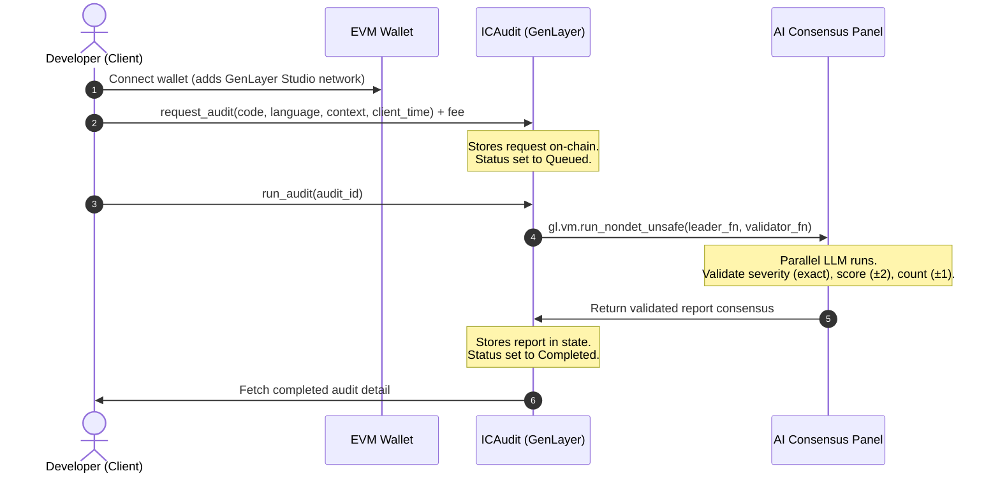

# 🔐 IC Audit

**Decentralized Smart Contract Security Audits powered by Multi-Agent AI Consensus on GenLayer.**

IC Audit is a security platform that leverages GenLayer's unique **Intelligent Contracts** and **Decentralized AI Validator Consensus** to provide developers with instant, multi-perspective code reviews. 

By executing a panel of independent AI models inside GenVM, IC Audit eliminates the risks of single-LLM hallucinations, ensuring audit reports are only written to the ledger when consensus bounds on severity rating, security score, and issue count are met.

---

## 🚀 Key Improvements & Standout Features

Compared to traditional off-chain scanners or basic AI contract prototypes, IC Audit introduces critical protocol improvements:

1. **Deterministic Timestamps:** Solved the critical blockchain non-determinism bug by replacing standard library system clock calls (`datetime.now()`) with client-signed deterministic timestamps.
2. **Robust LLM Validation:** Added `try-except` defensive JSON parsing logic in validators to protect validator nodes from crashing when processing malformed LLM responses.
3. **Withdrawal Payouts:** Added standard owner-only fee collection mechanics (`withdraw_fees`) to prevent GEN tokens paid for audits from becoming permanently locked inside the contract.
4. **GenLayer Safety Checks:** Configured validator prompts to specifically audit for GenLayer-specific patterns (like standard list usage instead of state wrappers, system clock calls in write operations, and unsanitized non-deterministic calls).
5. **Classy Premium UI:** Designed a modern, glassmorphic dashboard (slate background with glowing indicators) that presents metrics, code snippets, and audit issue listings with recommended inline code fixes.
6. **Direct Wallet Signing:** Connects standard EVM wallets (MetaMask, Rabby) directly using RPC configurations, avoiding the need for browser Snap installations.

---

## 🛠 How It Works

The lifecycle of an audit on IC Audit involves three core stages:



1. **Request Review:** A developer submits a smart contract snippet, functional context, and client timestamp, paying an audit fee in GEN tokens.
2. **Trigger Audit:** The consensus process is kicked off via a write transaction, triggering parallel LLM execution across GenLayer validator nodes.
3. **Resolve Consensus:** The leader's audit findings are validated against validator runs. If the evaluations align within the rules, the finalized audit is persisted on-chain.

---

## 📂 Project Structure

```
IC_audit/
├── contracts/
│   └── ic_audit.py       # Intelligent Contract (Python + GenLayer SDK)
├── tests/
│   └── test_ic_audit.py  # Python compilation mock test script
├── frontend/
│   ├── src/
│   │   ├── app/
│   │   │   ├── layout.tsx
│   │   │   ├── page.tsx  # Glassmorphic React dashboard
│   │   │   └── globals.css
│   │   └── lib/
│   │       └── genlayer.ts # RPC connections and wallet connector
│   ├── package.json
│   ├── tsconfig.json
│   └── next.config.ts
├── .gitignore
└── README.md
```

---

## ⚙️ Quick Start

### 1. Smart Contract Development & Testing

#### Prerequisites
Install the GenLayer CLI and check type formatting:
```bash
npm install -g genlayer
```

#### Linting & Typecheck
Run the linter and TypeScript compiler checks on the contract file:
```bash
genvm-lint check contracts/ic_audit.py
genvm-lint typecheck contracts/ic_audit.py
genvm-lint validate contracts/ic_audit.py
```

#### Run Mock Tests
Run the mock execution test script:
```bash
python3 tests/test_ic_audit.py
```

#### Local Deployment
Configure your account and deploy to the Studio network:
```bash
genlayer network set studionet
genlayer account create --name deployer --password "your_password"
genlayer account unlock --password "your_password"
genlayer deploy --contract contracts/ic_audit.py
```

---

### 2. Frontend Dashboard Setup

#### Installation
Navigate to the frontend folder and install dependency packages:
```bash
cd frontend
npm install
```

#### Environment Setup
Create a `.env.local` file inside the `frontend` folder using the template:
```bash
cp .env.example .env.local
```
Update `NEXT_PUBLIC_CONTRACT_ADDRESS` to point to your deployed contract address.

#### Run Dev Server
Start the local development server:
```bash
npm run dev
```
Open [http://localhost:3000](http://localhost:3000) to view the classy audit dashboard.

#### Static Export Build
Build and export static HTML assets for Cloudflare Pages or Netlify hosting:
```bash
npm run build
```
Static HTML build outputs will be saved to the `frontend/out/` directory.

---

## 📜 License

This project is licensed under the MIT License - see the LICENSE file for details.
